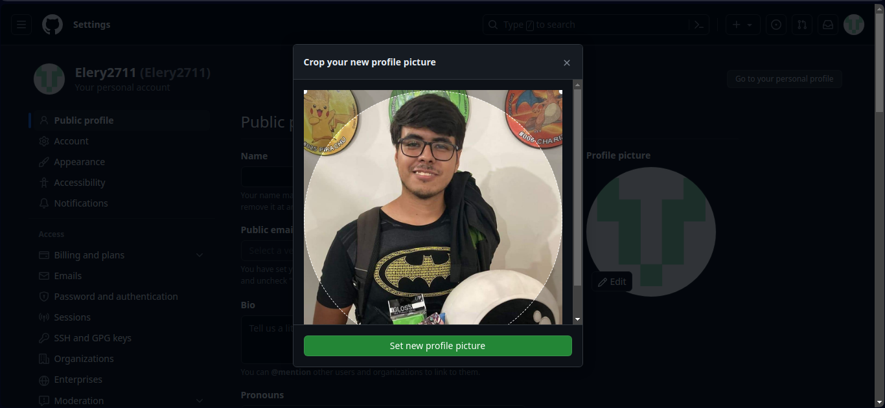
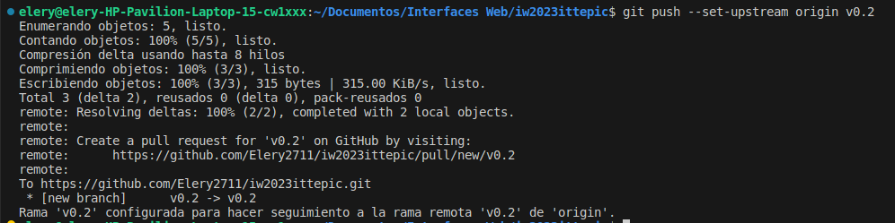

Parte 1  
  
#git clone https://github.com/Elery2711/iw2023ittepic.git  
#cd iw2023ittepic  
#git add *  
#git commit  
  
  
#git tag -a v0.1 -m "Initial commit"  
#git tag  
#git commit -a -m "Subir cambios"  
  
  
  

|Nombre             |Github |  
|-------------------|-------|
|gsuvo              |https://github.com/gsuvo|
|DarkMartin18       |https://github.com/DarkMartin18|
|JoseCalvario8      |https://github.com/JoseCalvario8|  
|RanitaDeMay        |https://github.com/RanitaDeMay|  
|GiovanniCarrillo   |https://github.com/GiovanniCarrillo|
|MDeRobles          |https://github.com/MDeRobles|
|saliesperanzama    |https://github.com/saliesperanzama|
|EsGaCristo         |https://github.com/EsGaCristo|
|mafefloresso       |https://github.com/mafefloresso|
|Railgun124         |https://github.com/Railgun124|
|valgd              |https://github.com/valgd|
|Lluan12            |https://github.com/Lluan12|
|LalokeraXD         |https://github.com/LalokeraXD|
|aldajassofl        |https://github.com/aldajassofl|
|dloram15           |https://github.com/dloram15|
|Hombrux            |https://github.com/Hombrux|
|Alessandra222      |https://github.com/Alessandra222|
|SebastianMedina2023|https://github.com/SebastianMedina2023|
|Rockoletal         |https://github.com/Rockoletal|
|EduardoMezaA       |https://github.com/EduardoMezaA|
|edramontoyava      |https://github.com/edramontoyava|
|Murgx              |https://github.com/Murgx|
|PaulOchoa952       |https://github.com/PaulOchoa952|
|XxXelbichoXxX      |https://github.com/XxXelbichoXxX|
|SrPonny132         |https://github.com/SrPonny132|
|andrestian01       |https://github.com/andrestian01|
|PaulRazon          |https://github.com/PaulRazon|
|IvanRobles19       |https://github.com/IvanRobles19|
|msalas18           |https://github.com/msalas18|
|elVeector          |https://github.com/elVeector|
#git push

Parte 2  
#git checkout -b v0.2  
#git branch  
#git add *  
#git commit  

#git push --set-upstream origin v0.2

#git checkout main
#git merge v0.2