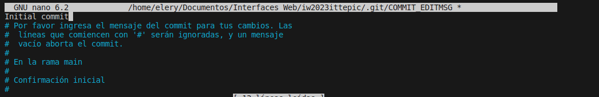

 \n
git clone https://github.com/Elery2711/iw2023ittepic.git \n
cd iw2023ittepic \n
git add * \n
git commit \n
 \n
 \n
git tag -a v0.1 -m "Initial commit" \n
git tag \n
git commit -a -m "Subir cambios" \n